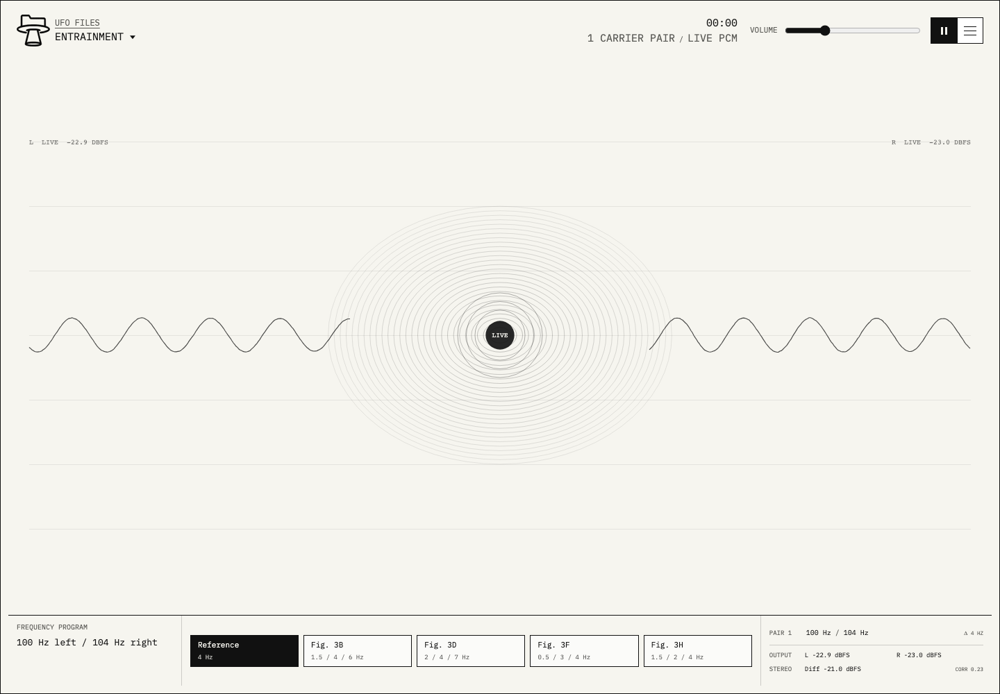

# Entrainment

[](https://github.com/ufo-files/entrainment/actions/workflows/test.yml)
[](https://github.com/ufo-files/entrainment/actions/workflows/pages.yml)

An inspectable stereo audio synthesizer inspired by Robert A. Monroe's expired
US patent [US5213562A](https://patents.google.com/patent/US5213562A/en).

Live app: https://ufo-files.github.io/entrainment/



The app implements the portions of the patent that can be reproduced as a
browser audio instrument:

- independent carrier signals delivered to the left and right channels;
- the patent's 100 Hz / 104 Hz reference example, producing a 4 Hz difference;
- multi-pair differential frequency sets identified in Figures 3B, 3D, 3F,
  and 3H;
- amplitude contouring; and
- a deterministic pink-noise layer with cyclic panning and filtering, kept at
  least 10 dB below the carrier reference.
- post-volume, post-compressor left and right PCM analyser taps that drive the
  live waveform, stereo-difference field, dBFS levels, and correlation readout.

The instrument does **not** capture, infer, or reproduce EEG recordings. Carrier
placement for the multi-pair figure programs is app-defined because the patent
names differential frequencies without providing reproducible source EEG data.

## Use

Stereo headphones are required to preserve separate left and right carrier
signals. Start at low volume. Stop if you feel discomfort, and do not use the
app while driving or operating machinery.

This is an experimental audio tool, not a medical device. Effects described in
the patent are historical patent claims and are not presented by UFO Files as
established medical or scientific outcomes.

## Development

```sh
npm ci
npm test
npm run test:browser
npm run serve
```

Open <http://127.0.0.1:4173>.

Capture the desktop and mobile reference views with:

```sh
npm run screenshots
```

## Signal Model

For each pair, the browser creates one sine oscillator routed only to the left
channel and another routed only to the right. Their frequency difference is the
displayed beat frequency. Multi-pair programs sum three independently routed
pairs at gain scaled by the square root of the pair count.

The pink layer uses seeded, deterministic pink-noise samples. A low-frequency
cycle modulates stereo panning and filter frequency. The UI constrains the layer
to -10 dB or lower relative gain, following the patent's stated design boundary.

Audio starts only after a user gesture, as required by modern browsers.

Before audio starts, the canvas is a mathematical preview of the configured
carrier pair. During playback, the left and right traces are drawn from the
actual PCM stream sent to each output channel. The center field maps live
stereo-difference RMS into ring deformation and correlation into ring aspect;
its center reports the same correlation snapshot. The field has no pointer or
decorative rotational motion.

## Project Links

- [UFO Files](https://ufo-files.app/)
- [Source](https://github.com/ufo-files/entrainment)
- [US5213562A](https://patents.google.com/patent/US5213562A/en)
- [Anonymous tips](https://tips.hushline.app/to/ufo-files)
